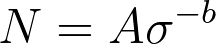
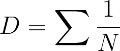
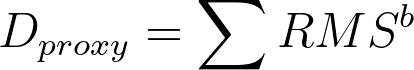
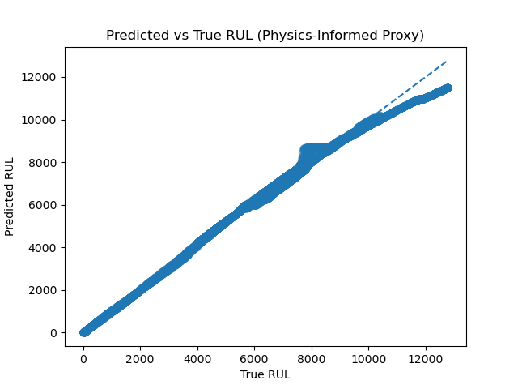
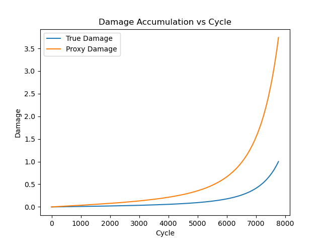

# Physics-Informed Reliability Modeling for Vibration-Driven Tool Lifetime Prediction

## Abstract

Cutting tool degradation in oscillating multi-tool (OMT) metal sawing operations is governed by vibration-induced fatigue and progressive wear. Internal cumulative fatigue damage is not directly observable in industrial environments, making accurate Remaining Useful Life (RUL) prediction challenging.

This project develops a physics-informed reliability modeling framework that integrates:

- Vibration-driven dynamic simulation  
- Fatigue damage accumulation based on S–N curves  
- Wear-force feedback coupling  
- Monitoring-based feature extraction (RMS vibration)  
- Machine learning-based RUL prediction  

A physics-inspired observable damage proxy derived from Miner’s rule is introduced to approximate internal cumulative fatigue damage using measurable vibration signals.

Results demonstrate that physics-informed modeling significantly improves predictive accuracy compared to purely data-driven approaches.

---

## Mathematical Foundation

### Fatigue Life Model (S–N Curve)

Fatigue life is modeled using a stress-life relationship:

Where:
- \( \sigma \) = stress amplitude  
- \( A, b \) = material-dependent fatigue parameters  

---

### Miner’s Rule for Cumulative Damage

Cumulative fatigue damage is computed as:

Failure occurs when:

---

### Observable Damage Proxy

Since internal fatigue damage is not directly measurable, an observable proxy is constructed from vibration monitoring:

RMS vibration amplitude acts as a stress surrogate, linking measurable signals to underlying fatigue physics.

This bridges physics-based degradation modeling with monitoring-driven predictive maintenance.

---

## Modeling Pipeline

1. Blade vibration dynamics simulation  
2. Stress estimation from displacement  
3. Fatigue damage accumulation  
4. Wear-force feedback coupling  
5. Monitoring feature extraction (RMS, peak)  
6. RUL dataset generation  
7. Machine learning-based RUL prediction  
8. Physics-informed hybrid modeling  

---

## Experimental Results

| Model | MAE (cycles) | R² |
|-------|--------------|-----|
| Linear ML-only | ~1734 | 0.66 |
| Random Forest ML-only | ~600 | 0.93 |
| Random Forest Proxy-Damage | ~190 | 0.992 |
| Random Forest Hybrid | ~204 | 0.991 |

## Visualization of Results

### Predicted vs True RUL (Physics-Informed Proxy Model)

The physics-informed proxy model achieves near-perfect alignment between predicted and true Remaining Useful Life values.

The tight clustering around the diagonal confirms strong generalization performance across operating conditions.

---

### Damage Accumulation vs Cycle

The degradation simulation shows nonlinear fatigue progression with accelerated damage growth toward failure.

Key observations:

- True fatigue damage grows nonlinearly and reaches failure at D ≥ 1  
- Proxy damage follows a similar acceleration trend  
- Both exhibit realistic late-life degradation acceleration  

This validates the physical consistency of the simulation framework.

### Key Insight

Observable vibration-based damage proxies can approximate internal cumulative fatigue damage with high fidelity.  

Compared to ML-only models:

- MAE reduced by ~65%  
- R² improved from ~0.93 to ~0.992  

This demonstrates the value of embedding reliability physics into predictive models.

---

## Industrial Relevance

This framework aligns directly with vibration-driven lifetime modeling challenges in metal cutting applications:

- Predictive maintenance integration  
- Reliability engineering  
- Physics-informed machine learning  
- Monitoring-based degradation estimation  
- Hybrid simulation + data-driven modeling  

The approach illustrates how simulation models and monitoring data can be combined to improve tool lifetime prediction in industrial environments.

---

## Repository Structure

The project is organized in a modular and research-oriented architecture to clearly separate physical modeling, data generation, and machine learning components.

physics_informed_tool_reliability/

│  
├── src/  
│   ├── dynamics/        # Blade vibration dynamics model  
│   ├── fatigue/         # Fatigue damage accumulation (S–N based)  
│   ├── wear/            # Wear progression model  
│   ├── monitoring/      # Signal feature extraction (RMS, peak)  
│   ├── simulation/      # Physics-based degradation simulator  
│   └── predictive/      # Dataset generation & ML-based RUL prediction  
│  
├── experiments/  
│   ├── generate_dataset.py   # Generates full RUL dataset  
│   ├── analyze_dataset.py    # Dataset inspection & statistics  
│   ├── test_simulation.py    # Quick simulation sanity test  
│   └── plot_degradation.py   # Degradation Curve (Damage vs Cycles) : True & Proxy
│  
├── data/                # Generated RUL dataset (CSV)  
├── docs/                # Figures and rendered equations  
├── config/              # Reserved for configuration files  
├── tests/               # Reserved for unit tests  
│  
├── requirements.txt  
└── README.md  

This structure enforces a clean separation between:

- Core physics modules  
- Simulation engine  
- Predictive modeling  
- Experimental scripts  

---

## Reproducibility

To ensure reproducibility:

- Fixed random seeds are used where applicable  
- Dataset generation parameters are explicitly defined  
- Train/test splitting is performed using group-based splitting (by run ID)  
- Results are deterministic for fixed hyperparameters  

---

## How to Run

### 1. Install Dependencies

Create and activate a virtual environment (recommended), then install required packages:

    pip install -r requirements.txt

---

### 2. Generate the RUL Dataset

To simulate degradation across multiple operating conditions and generate the Remaining Useful Life (RUL) dataset, run:

    python -m experiments.generate_dataset

This script will:

- Simulate blade vibration dynamics  
- Accumulate fatigue damage using an S–N formulation  
- Model wear-force feedback coupling  
- Compute an observable damage proxy from RMS vibration  
- Generate RUL labels  
- Save the dataset to: data/rul_dataset.csv  

Dataset generation may take several minutes depending on parameter ranges.

---

### 3. Train and Evaluate RUL Prediction Models

To train machine learning models and compare ML-only vs physics-informed approaches:

    python -m src.predictive.train_rul_model

The script evaluates:

- Linear Regression (baseline)
- Random Forest (ML-only)
- Random Forest (Proxy-Damage, physics-informed)
- Random Forest (Hybrid, full internal physics state)

Evaluation metrics printed:

- Mean Absolute Error (MAE)
- R² score

Feature importance plots (if enabled) will be saved in the docs/ directory.

---

## Reproducibility

To ensure deterministic results:

- Random seeds are fixed where applicable
- Group-based train/test splitting is used (split by run ID)
- Simulation parameters are explicitly defined
- Model hyperparameters are fixed

Running the same configuration will produce identical results.

---

## Key Contributions

This project demonstrates:

1. Integration of vibration dynamics with fatigue degradation modeling  
2. Construction of an observable physics-based damage proxy  
3. Quantitative comparison between:
   - Pure ML models  
   - Physics-informed proxy models  
   - Hybrid internal-state models  
4. Significant RUL error reduction (>65%) using physics-informed features  

---

## Future Extensions

Potential research directions include:

- Uncertainty quantification for RUL prediction  
- Physics-informed neural networks  
- Domain generalization across operating regimes  
- Integration with real-world vibration datasets  
- Causal modeling of degradation mechanisms  

---

## Author

Dhananjay Poddar  
M.Sc. Electromobility  
Reliability Engineering | Physics-Informed Machine Learning

